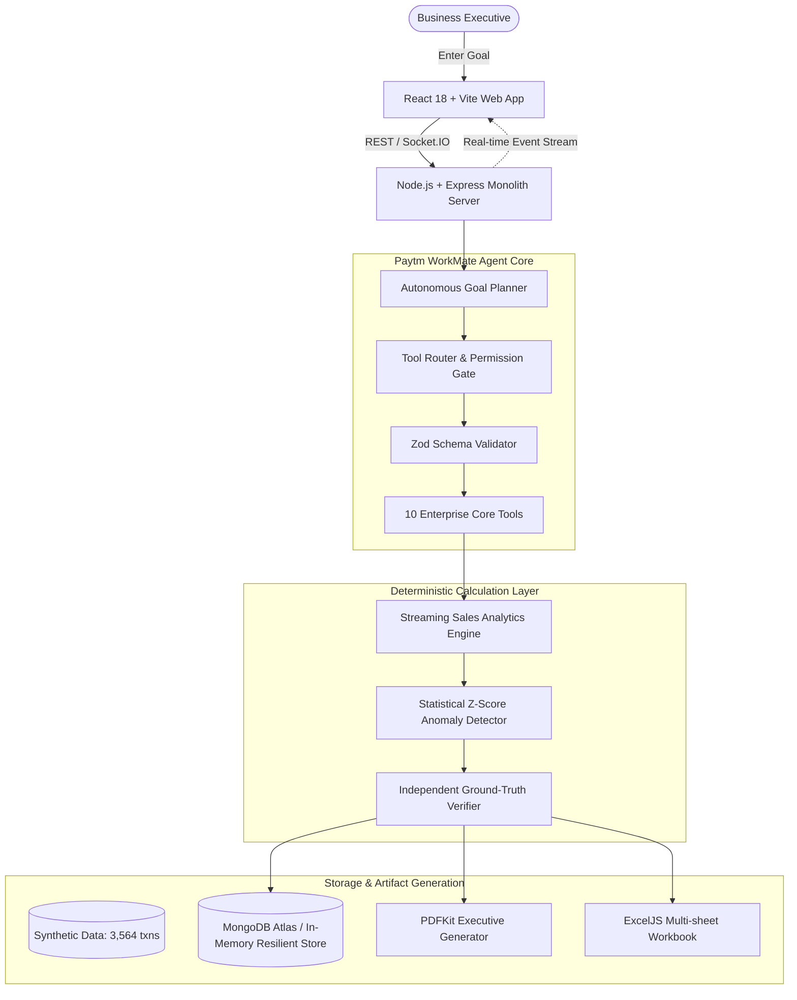

# PAYTM WORKMATE
### *"From Prompt to Done."*

> **Hackathon Track:** Autonomous AI Teammates  
> **Target Persona:** Enterprise Product, Finance & Operations Executives  
> **Key Mantra:** *"ChatGPT can answer a request. WorkMate turns a business goal into a structured workflow, executes authorized tools, validates important results, and delivers a completed business artifact with proof of work."*

---

## 1. Project Overview & Core Philosophy

Paytm WorkMate is an **Autonomous AI Teammate** designed specifically for high-stakes business and financial operations. Unlike generic conversational chatbots that simply generate conversational text, WorkMate accepts high-level outcome-based business objectives, formulates an executable plan, gates high-risk actions through permission checks, performs deterministic aggregations, detects statistical business anomalies, independently cross-verifies every number against raw disk storage, and exports publication-ready executive reports in both PDF and multi-sheet Excel formats.

### The Primary Hackathon Demo Workflow
```
"Analyze September sales, identify the biggest business issues and prepare a management report."
```

When a user assigns this goal, WorkMate visibly executes:
```
USER GOAL
   ↓
GOAL PARSER & PLANNER
   ↓
TOOL SELECTION
   ↓
PERMISSION & ZOD VALIDATION
   ↓
DATA STREAM (sales.csv: 3,564 records)
   ↓
DETERMINISTIC ANALYSIS (GMV, AOV, Categories, Segments)
   ↓
ANOMALY DETECTION (Revenue drops, discount erosion, failure spikes)
   ↓
INDEPENDENT VERIFICATION (Raw stream cross-check: ±1.00 INR tolerance)
   ↓
EXECUTIVE REPORT COMPILATION (PDF + Excel .xlsx)
   ↓
PROOF OF WORK LEDGER (Cryptographic audit hash)
   ↓
TASK COMPLETED
```

---

## 2. System Architecture



---

## 3. Technology Stack & Design Rationale

| Layer | Technology | Rationale |
|---|---|---|
| **Frontend Web App** | React 18, Vite, TypeScript | Lightning-fast rendering, strict type safety, instant HMR. |
| **Styling & UI** | Tailwind CSS, Lucide Icons | Paytm fintech brand styling (Deep Navy `#002970` & Cyan `#00BAF2`), crisp corporate cards. |
| **Data Visualizations** | Recharts | Interactive SVG charts for daily revenue trends and category market share. |
| **Real-time Streaming** | Socket.IO Client | Live step progress, terminal streaming, and approval popups without polling. |
| **AI / LLM Engine** | **Google Gemini 2.5 Flash** (`@google/genai`) | High-velocity goal parsing, structured dynamic plan generation, and executive insights interpretation. |
| **Backend Monolith** | Node.js, Express, TypeScript | High-concurrency async I/O, unified monorepo structure. |
| **Data Engine** | Streaming CSV Parser + Pure JS Math | Deterministic aggregations with zero external microservice downtime risk. |
| **Data Validation** | Zod | Enforces strict type schemas on goal inputs, tool parameters, and uploads. |
| **Security & Auth** | JWT, bcryptjs | Industry-standard token auth with 1-click executive demo sign-in. |
| **Database** | MongoDB Atlas + In-Memory Fallback | Dual storage layer: seamlessly operates in resilient in-memory mode if Mongo is offline. |
| **PDF Generation** | PDFKit | Generates pixel-perfect executive reports with color headers and KPI tables. |
| **Excel Generation** | ExcelJS | Generates multi-sheet spreadsheets (`Summary`, `Categories`, `Customers`, `Products`, `Anomalies`). |

---

## 4. Folder Structure (Clean Monolith)

```
/Users/vaibhavjain/Desktop/paytm/
├── client/                     # Frontend React + Vite + Tailwind application
│   ├── src/
│   │   ├── api/                # REST client for tasks, approvals, reports, logs
│   │   ├── components/layout/  # Navbar with status pills & Footer with disclaimers
│   │   ├── context/            # Socket.IO real-time Context Provider
│   │   ├── pages/              # 10 Required Enterprise Pages
│   │   │   ├── LandingPage.tsx     # Hero, 4 pillars, architecture preview
│   │   │   ├── Dashboard.tsx       # Teammate status, KPI cards, recent tasks
│   │   │   ├── NewTaskPage.tsx     # Goal input, preset chips, autonomy modes
│   │   │   ├── TaskExecutionPage.tsx # 3-Column live workspace & approval banner
│   │   │   ├── FinalResultPage.tsx # Verified report, Recharts, PDF/Excel download
│   │   │   ├── ApprovalCenter.tsx  # Consequential action authorization
│   │   │   ├── ImpactDashboard.tsx # Modeled analyst hours saved & ROI
│   │   │   ├── AuditLogsPage.tsx   # Cryptographic proof-of-work ledger
│   │   │   ├── SettingsPage.tsx    # Diagnostics, synthetic data inspector
│   │   │   └── LoginPage.tsx       # 1-Click Executive Demo Login
│   │   ├── types/              # Type definitions
│   │   ├── App.tsx             # Main router
│   │   └── main.tsx            # DOM root
│   ├── package.json
│   └── vite.config.ts          # Configured with proxy to port 5001
│
├── server/                     # Backend API & Agent Orchestration
│   ├── src/
│   │   ├── agent/              # Autonomous Planner, Tool Router, Executor
│   │   │   ├── planner.ts      # Structured JSON plan creator
│   │   │   ├── toolRouter.ts   # Tool registry, permissions & Zod validation
│   │   │   └── executor.ts     # Step-by-step runner with Socket.IO emissions
│   │   ├── analytics/          # Deterministic Calculations
│   │   │   ├── salesEngine.ts  # GMV, orders, AOV, category shares, anomalies
│   │   │   └── verificationEngine.ts # Raw stream cross-checker
│   │   ├── reports/            # PDF and Excel artifact generators
│   │   │   ├── pdfGenerator.ts
│   │   │   └── excelGenerator.ts
│   │   ├── routes/             # Express API endpoints
│   │   ├── storage/            # Dual MongoDB + Resilient In-Memory store
│   │   ├── config.ts           # Environment variable loader
│   │   └── index.ts            # HTTP & Socket.IO server entry point
│   ├── tests/
│   │   └── e2e.test.ts         # Automated end-to-end integration test
│   └── package.json
│
├── data/                       # Synthetic Demo Datasets (Clearly labeled)
│   ├── sales/sales.csv         # 3,564 September 2024 merchant transactions
│   ├── customers/customers.csv # 500 synthetic merchant profiles
│   └── products/products.csv   # 17 Soundbox & POS hardware SKUs
│
├── .env.example                # Full environment template with descriptions
├── .env                        # Local dev environment configuration
├── package.json                # Root orchestrator with concurrently
└── README.md
```

---

## 5. Environment Variables

Create `.env` in the project root:

```ini
# Port on which the Node.js Express server runs
PORT=5001
NODE_ENV=development

# Frontend Client URL
CLIENT_URL=http://localhost:5173

# MongoDB Atlas URI (leave default to auto-fallback to Resilient In-Memory Store)
MONGODB_URI=mongodb://localhost:27017/paytm_workmate

# JWT Secret for User Auth
JWT_SECRET=paytm_workmate_super_secret_jwt_key_2025_secure
JWT_EXPIRES_IN=7d

# Optional LLM API Key (Built-in deterministic planner works out-of-the-box!)
LLM_API_KEY=
LLM_MODEL=gpt-4o-mini
LLM_PROVIDER=openai

# Data and File Directories
DATA_DIR=../data
REPORTS_DIR=./generated_reports
MAX_UPLOAD_SIZE_BYTES=10485760
```

---

## 6. How to Run Locally

### Quick Start (Single Command)

From the project root:
```bash
# 1. Install all dependencies (root, server, client)
npm run install:all

# 2. Run the End-to-End Integration Test Suite
cd server && npm test && cd ..

# 3. Start both Server & Client concurrently
npm run dev
```

The application will launch on:
- **Frontend Web UI:** `http://localhost:5173`
- **Backend API & Socket.IO:** `http://localhost:5001`
- **Health Diagnostics:** `http://localhost:5001/health`

---

## 7. The Hackathon Presentation Flow (What Judges See)

1. **Landing Page (`http://localhost:5173`):**
   - Click **"Load Demo"** or **"Try AI Teammate"**.
2. **Dashboard:**
   - Displays real-time **AI Teammate Status** (`Ready for Work`).
   - Shows active tasks, rows analyzed, and estimated analyst time saved.
3. **New Task:**
   - Pre-loaded with: *"Analyze September sales, identify the biggest business issues and prepare a management report."*
   - Select **Copilot Mode** (AI pauses for human authorization before consequential actions).
   - Click **"Launch Autonomous Teammate"**.
4. **Live 3-Column Execution Workspace:**
   - **Left Column:** Target Goal, Autonomy Governance, active step counter.
   - **Center Column:** Visual checklist updating dynamically from `PENDING` → `RUNNING` → `COMPLETED`.
   - **Right Column:** Live Proof-of-Work Terminal streaming exact payloads.
   - **Copilot Approval Gate:** When reaching step 9, execution pauses with a high-visibility **Approval Banner**. Click **"Approve & Continue"**.
5. **Final Result Page:**
   - **Mathematical Verification Seal:** Confirms raw CSV recalculation passed within ±1.00 INR tolerance.
   - **KPI Cards:** ₹11.7M GMV, 3,564 orders, ₹3,284 AOV.
   - **Interactive Recharts:** Daily revenue curve with mid-month anomaly dip, category breakdown.
   - **Detected Anomalies:** Specific root causes (bank gateway timeout, promotional discount stacking).
   - **Working Downloads:** Click **"Download PDF Report"** and **"Download Excel"** to receive the generated files immediately.
6. **Audit Logs:**
   - Review the complete chronological cryptographic audit trail verifying every tool call.

---

## 8. Synthetic Data Integrity & Disclaimers

- **Synthetic Data Notice:** All records in `data/sales/sales.csv` are synthetically generated for demonstration of merchant and financial workflows.
- **No Private Paytm Integration:** Paytm WorkMate is a concept project for the Autonomous AI Teammates track. It does not access private Paytm internal systems, credentials, or proprietary merchant databases.
